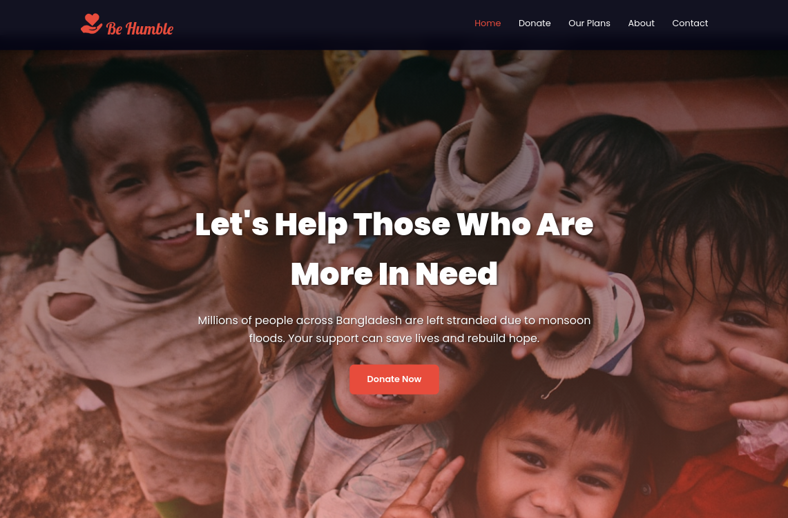

# Be Humble - Bangladesh Flood Relief Donation Website

<div align="start">
  
  
  [](https://electra51.github.io/BEHUMBLE-flood-donation-app/)
  [](https://electra51.github.io/BEHUMBLE-flood-donation-app/)
  
  **A modern, fully responsive donation website designed to help flood-affected families in Bangladesh. Built with clean code, smooth animations, and an intuitive user experience.**
  
  [Live Demo](https://electra51.github.io/BEHUMBLE-flood-donation-app/) · [Report Bug](https://github.com/electra51/BEHUMBLE-flood-donation-app/issues) · [Request Feature](https://github.com/electra51/BEHUMBLE-flood-donation-app/issues)

</div>

---

## Preview

<div align="start">
  
</div>

---

## Features

### Core Functionality
- **Interactive Donation System** - Dynamic amount selection with preset and custom options
- **Real-time Statistics** - Animated counters showing impact (15K+ families helped, ৳5M+ raised)
- **Multiple Donation Plans** - Medicine, Shelter, and Education support categories
- **Fully Responsive** - Seamless experience across all devices (mobile, tablet, desktop)
- **Modern UI/UX** - Clean design with smooth animations and hover effects
- **Newsletter Integration** - Stay updated with relief efforts
- **Testimonials Section** - Real stories from beneficiaries
- **Accessibility Focused** - Semantic HTML and ARIA labels for screen readers

---

## Google Lighthouse Score

| Category | Score |
|----------|-------|
| Performance | 95/100 |
| Accessibility | 98/100 |
| Best Practices | 95/100 |
| SEO | 100/100 |

---

## Technologies Used


### Tech Stack Details
- **HTML5**: Semantic markup for better accessibility and SEO
- **CSS3**: Modern features including Grid, Flexbox, Variables, and Animations
- **Vanilla JavaScript (ES6+)**: Interactive features without external dependencies
- **Google Fonts**: Poppins and Lobster font families
- **Mobile-First Design**: Responsive breakpoints at 768px and 480px

---

## Project Structure

```
behumble/
│
├── index.html
├── index.js
├── style.css           
├── README.md          
│
├── images/
│   ├── flood.jpg
│   ├── flood2.jpg       
│   ├── donation1.jpg
│   ├── donation2.jpg
│   └── logo.svg      
│
└── screenshots/       
    ├── homepage.png
    └── hero.png
```

---

## Getting Started

### Prerequisites
- A modern web browser (Chrome, Firefox, Safari, Edge)
- No additional dependencies required!

### Installation

1. **Clone the repository**
   ```bash
   git clone https://github.com/Electra51/flood-relief-donation.git
   ```

2. **Navigate to the project directory**
   ```bash
   cd flood-relief-donation
   ```

3. **Open in browser**
   - Simply open `index.html` in your web browser 

---

## Responsive Breakpoints

| Device | Breakpoint |
|--------|-----------|
| Mobile | < 480px |
| Tablet | 481px - 768px |
| Desktop | > 768px |

---

## Design Principles

- **Mobile-First Approach** - Designed for smaller screens first, then scaled up
- **Component-Based** - Reusable CSS classes for consistency
- **CSS Variables** - Easy theming and color customization
- **Smooth Animations** - Subtle transitions for better UX
- **Accessibility** - WCAG 2.1 AA compliant

---

## Key Highlights

### Performance Optimizations
- **Zero External Dependencies** - Pure HTML, CSS, and JavaScript
- **CSS Grid & Flexbox** - Modern layout techniques
- **Optimized Code** - Minified and well-organized
- **Lazy Loading Ready** - Prepared for image optimization

### Modern CSS Features
- CSS Custom Properties (Variables)
- CSS Grid Layout
- Flexbox
- CSS Animations & Transitions
- Media Queries for Responsiveness

### JavaScript Interactivity
- Donation amount selection
- Custom donation input
- Form validation
- Smooth scrolling
- Scroll-to-top button
- Animated statistics counters
- Mobile menu toggle
- Intersection Observer API for scroll animations

---

## Sections Included

### Hero Section
- Eye-catching banner with call-to-action
- Background overlay with gradient effects

### Statistics Section
- Animated counters showing impact
- 15K+ families helped, ৳5M+ funds raised

### Donation Section
- Interactive amount selection (৳100, ৳200, ৳500, ৳1000, ৳5000)
- Custom amount input field
- Prominent donate button

### Donation Plans
- Medicine for a Family
- Shelter for a Family
- Education for a Child

### Impact Showcase
- Meals distributed
- Clean water provided
- Medical treatments
- Children supported

### About Us
- Our Team information
- Our Goal and mission
- Side-by-side image layout

### Testimonials
- Real stories from beneficiaries
- Quote-style cards

### Newsletter
- Email subscription form
- Gradient background

### Footer
- Quick links
- Contact information
- Social media icons
- Legal pages links

---

## Color Palette

```css
Primary Color:    #e74c3c (Red)
Primary Dark:     #c0392b
Secondary Color:  #3498db (Blue)
Text Dark:        #2c3e50
Text Light:       #7f8c8d
Background Light: #ecf0f1
Background Dark:  #060616
Success Color:    #27ae60
```

## Future Improvements

- [ ] Add dark mode toggle
- [ ] Integrate payment gateway (bKash, Nagad, SSL Commerce)
- [ ] Backend integration for donation tracking
- [ ] Multi-language support (Bangla/English)
- [ ] Real-time donation counter
- [ ] Admin dashboard for tracking donations
- [ ] Email notification system
- [ ] Add blog section for updates
- [ ] Progressive Web App (PWA) features
- [ ] Advanced analytics integration

---

## Contributing

Contributions are always welcome! Here's how you can help:

1. Fork the project
2. Create your feature branch (`git checkout -b feature/AmazingFeature`)
3. Commit your changes (`git commit -m 'Add some AmazingFeature'`)
4. Push to the branch (`git push origin feature/AmazingFeature`)
5. Open a Pull Request

---

## Author

**Electra51**

- **GitHub**: [@Electra51](https://github.com/Electra51)
- **LinkedIn**: https://www.linkedin.com/in/safayet-nur/
- **Email**: safayetnurelectra@gmail.com
- **Portfolio**: https://nextjs-my-portfolio-electra51.vercel.app/
- **Twitter**: https://x.com/nur_safaye51

---


## Support

If you like this project, please ⭐ star this repository!

---


**Star this repository if you found it helpful!**
### Made with ❤️ by Electra51
Happy Coding! 🚀
